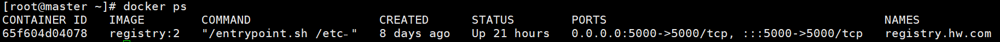
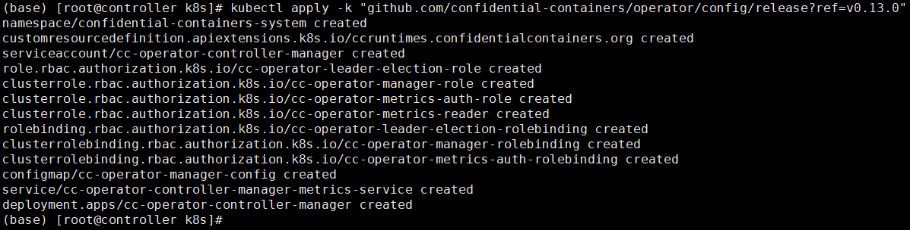
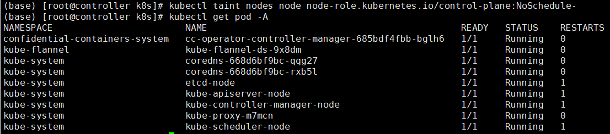
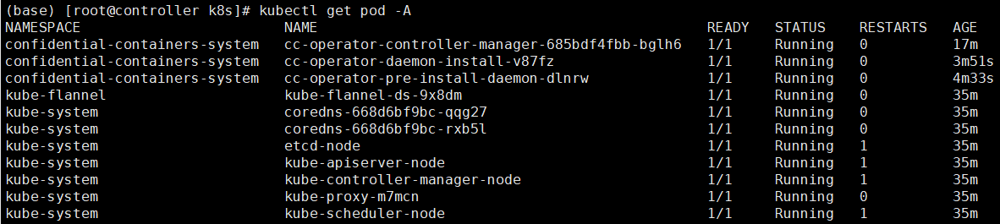
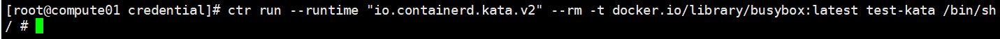

> 可单独准备一台普通环境部署docker以及registry本地镜像仓，执行`kata-deploy`生成deploy镜像。而具备`VirtCCA`安全能力的环境则专门作为机密容器执行环境。

# 源码准备

## 下载源码

```shell
# 进到目标路径
cd /home

# 下载v3.15.0的kata-containers
git clone https://github.com/kata-containers/kata-containers.git -b 3.15.0

mkdir -p kata-containers/build && cd kata-containers/build

# 下载guest-components、trustee、kbs-types到kata-containers/build
git clone https://github.com/confidential-containers/trustee.git -b v0.12.0
git clone https://github.com/confidential-containers/guest-components.git -b v0.12.0
git clone https://github.com/virtee/kbs-types.git

# 下载带有VirtCCA patch以及配置文件的VirtCCA_SDK
git clone https://gitee.com/openeuler/virtCCA_sdk.git
```

## 应用`VirtCCA`的修改patch

```shell
# 应用patch到kata-containers
cd /home/kata-containers
git apply ./build/virtCCA_sdk/kata-v3.15.0/kata-containers.patch
git apply ./build/virtCCA_sdk/kata-v3.15.0/kata-deploy.patch

# 应用patch到guest-components
cd /home/kata-containers/build/guest-components
git apply ../virtCCA_sdk/kata-v3.15.0/guest-components.patch

# 应用patch到trustee
cd /home/kata-containers/build/trustee
git apply ../virtCCA_sdk/kata-v3.15.0/trustee.patch

# 应用patch到kbs-type
cd /home/kata-containers/build/kbs-types
git reset --hard 611889d22e5a4e8e57f13a33a1bdf03aa4aa9c70
git apply ../virtCCA_sdk/kata-v3.15.0/kbs-types.patch
```

## 拷贝`VirtCCA`配置文件到目标路径

```shell
cd /home/kata-containers

# 拷贝guest kernel的编译配置文件
cp ./build/virtCCA_sdk/kata-v3.15.0/conf/virtcca.config ./build/

# 拷贝registry本地镜像仓对应的根证书
mkdir -p ./tools/osbuilder/rootfs-builder/ubuntu/certs
cp ./build/virtCCA_sdk/kata-v3.15.0/conf/rootCA.crt ./tools/osbuilder/rootfs-builder/ubuntu/certs/

# 拷贝包含本地镜像仓域名解析信息的/etc/hosts文件
cp ./build/virtCCA_sdk/kata-v3.15.0/conf/hosts ./build/
```


# 编译`kata-deploy`镜像文件

## docker 安装参考

1. 安装docker。

   ```
   yum install -y docker httpd-tools
   ```

2. 启动docker服务，并设置开机自启。

   ```
   systemctl start docker
   systemctl enable docker
   ```

3. 配置docker镜像源。

   ```
   vim /etc/docker/daemon.json

   {
     "registry-mirrors": [
           "https://registry.docker-cn.com",
           "http://hub-mirror.c.163.com"
     ],

     "dns": [
       "114.114.114.114",
       "110.110.110.110",
       "8.8.8.8"
     ]
   }
   ```

4. 配置docker代理。

   ```
   mkdir -p /etc/systemd/system/docker.service.d
   vim /etc/systemd/system/docker.service.d/http-proxy.conf
   ```

5. 配置代理IP。

   ```
   [Service]
   Environment="HTTP_PROXY=http://proxy.example.com:port/"
   Environment="HTTPS_PROXY=https://proxy.example.com:port/"
   ```

   > **说明：**
   >若HTTPS\_PROXY字段没有可用的https代理，可使用http作为替代。

6. 重启docker。

   ```
   systemctl daemon-reload
   systemctl restart docker
   ```

7. 拉取registry镜像。

   ```
   docker pull registry:2
   ```

## 编译`kata-deploy`镜像
```shell
# 编译成功后当前路径下新增kata-static.tar.xz
cd /home/kata-containers/tools/packaging/kata-deploy/local-build
export USE_CACHE="no"
make
```

# 添加kata-deploy镜像到本地镜像仓

## 创建根证书并签发`domin`证书

```bash
 mkdir -p /home/registry && cd /home/registry
 
 # 创建根证书私钥
 openssl genrsa -out /home/registry/certs/rootCA.key 4096

 # 生成自签名的根证书
 openssl req -x509 -new -nodes -key /home/registry/certs/rootCA.key \
 -sha256 -days 3650 -out /home/registry/certs/rootCA.crt \
 -subj "/CN=My Local Root CA" \
 -addext "basicConstraints=critical,CA:TRUE"

# 创建域名私钥
openssl genrsa -out /home/registry/certs/domain.key 4096

# 生成证书签名请求（CSR），包含SAN扩展
openssl req -new -key /home/registry/certs/domain.key \
-out /home/registry/certs/domain.csr \
-subj "/CN=registry.hw.com" \
-addext "subjectAltName=DNS:registry.hw.com"

# 使用根证书签发域名证书
openssl x509 -req -in /home/registry/certs/domain.csr \
-CA /home/registry/certs/rootCA.crt \
-CAkey /home/registry/certs/rootCA.key \
-CAcreateserial -out /home/registry/certs/domain.crt \
-days 365 -sha256 \
-extfile <(printf "subjectAltName=DNS:registry.hw.com")
```

> 需要将rootCA.crt添加到镜像仓所在环境、执行环境的host和guest文件系统。(kata-deploy将自动化部署安装rootCA.crt到guest文件系统)


## 启动registry本地镜像仓

1. 配置文件：`/home/registry/config.yml`

```yaml
version: 0.1
   log:
     accesslog:
       disabled: false  # 启用访问日志
     level: debug       # 可选：设置全局日志级别
   storage:
     filesystem:
       rootdirectory: /var/lib/registry
   http:
     addr: :5000
     tls:
       certificate: /certs/domain.crt # 使用根证书签发的域证书
       key: /certs/domain.key
```

2. 启动registry容器。（不使用用户名和密码）

```sh
docker run -d -p 5000:5000 \
  --restart=always \
  --name registry.hw.com \
  -v /home/registry/certs:/certs \
  -v /home/registry/data:/var/lib/registry \
  -v /home/registry/config.yml:/etc/docker/registry/config.yml \
  registry:2 > /home/fuju/registry/registry.log 2>&1 &
```

>  查看registry调测日志：`docker logs -f registry.hw.com`

3. 设置docker本地仓所在服务器的域名IP。

```
vim /etc/hosts
127.0.0.1 registry.hw.com
```

> **说明：** 
>外部服务器访问私有仓请配置私有仓所在服务器IP，内网部署请及时取消代理。

4. 将上文用户生成的根证书rootCA.crt写入docker本地仓所在服务器根证书。

```
cat /home/registry/certs/rootCA.crt >>/etc/pki/ca-trust/extracted/pem/tls-ca-bundle.pem
cat /home/registry/certs/rootCA.crt >>/etc/pki/ca-trust/extracted/openssl/ca-bundle.trust.crt
```

> **说明：** 
>拷贝rootCA.crt到机密容器执行服务器，执行下方命令将rootCA.crt追加到tls-ca-bundle.pem和ca-bundle.trust.crt。
>
>```
>cat /home/registry/certs/rootCA.crt >>/etc/pki/ca-trust/extracted/pem/tls-ca-bundle.pem
>cat /home/registry/certs/rootCA.crt >>/etc/pki/ca-trust/extracted/openssl/ca-bundle.trust.crt
>```

5. 执行下方命令可查看正在运行的registry容器。

```
docker ps
```



## 添加镜像到镜像仓

```shell
cd /home/kata-containers/tools/packaging/kata-deploy
cp ./local-build/kata-static.tar.xz ./

# 创建kata-deploy镜像
docker build -t kata-deploy .

docker tag kata-deploy:latest registry.hw.com:5000/kata-deploy:latest
docker push registry.hw.com:5000/kata-deploy:latest
```

# 执行virtcca的operator

```shell
kubectl apply -k github.com/confidential-containers/operator/config/release?ref=v0.13.0
kubectl taint nodes node node-role.kubernetes.io/control-plane:NoSchedule-
kubectl label node node node.kubernetes.io/worker=
sleep 5s
```



operator-controller创建成功后集群状态如下：



```shell
# payloadImage字段指定了kata-deploy镜像路径，例如：registry.hw.com:5000/kata-deploy-test:latest
kubectl apply -f /home/kata-containers/build/virtCCA_sdk/kata-v3.15.0/conf/virtcca-kata-deploy.yaml
```

kata-deploy的operator创建成功后集群状态如下：




## 执行测试pod，检查集群是否成功部署。

`vim ./test-kata-qemu-virtcca.yaml`

```yaml
apiVersion: v1
kind: Pod
metadata:
  name: test-kata-qemu-virtcca
  annotations:
    io.containerd.cri.runtime-handler: "kata-qemu-virtcca"
    io.katacontainers.config.hypervisor.kernel_params: "agent.debug_console agent.log=debug"
spec:
  runtimeClassName: kata-qemu-virtcca
  terminationGracePeriodSeconds: 5
  containers:
  - name: box-1
    image: registry.hw.com:5000/busybox:latest
    imagePullPolicy: Always
    command:
    - sh
    tty: true
```

> 卸载kata-qemu-virtcca的operator操作：
>
> ```shell
> kubectl delete -f /home/kata-containers/build/virtCCA_sdk/kata-v3.15.0/conf/virtcca-kata-deploy.yaml
> sleep 5s
> kubectl delete -k github.com/confidential-containers/operator/config/release?ref=v0.13.0
> ```

至此，用户已经可以基于`kata-qemu-virtcca`容器运行时运行机密容器（pod)。

## 支持ctr启动机密容器
```shell
    mkdir -p /etc/kata-containers
    cp /opt/kata/share/defaults/kata-containers/configuration-qemu-virtcca.toml /etc/kata-containers/configuration.toml
    sed -i 's/^\([[:space:]]*shared_fs[[:space:]]*=[[:space:]]*\)"[^"]*"/\1"virtio-fs"/' /etc/kata-containers/configuration.toml
    cp /opt/kata/bin/containerd-shim-kata-v2 /usr/bin/containerd-shim-kata-v2
    cp /opt/kata/bin/kata-runtime /usr/bin/kata-runtime
```
> 注意：ctr 启动机密容器时，使用的是/etc/kata-containers/configuration.toml配置文件，需要与operator管理的runtime配置文件区分开。

运行一个容器，指定runtime为kata。

```
ctr run --runtime "io.containerd.kata.v2" --rm -t docker.io/library/busybox:latest test-kata /bin/sh
```

