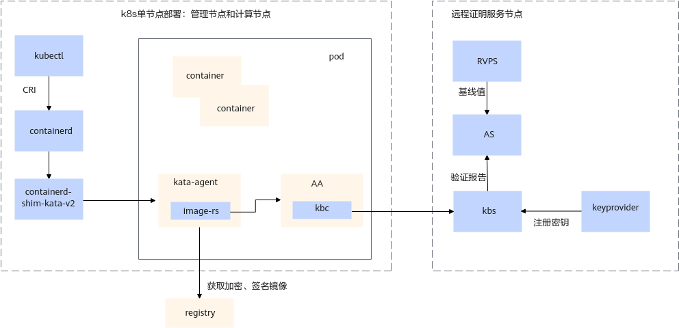

# kata机密容器

kata容器又称安全容器，容器运行在轻量级虚拟机中，而不是直接在宿主机内核上，这种方式提供了类似传统虚拟机的强隔离，防止不同容器之间的安全问题。

基于TEE安全套件构建的机密容器，是在kata容器的基础上，将该轻量级虚拟机替换为virtcca的机密虚拟机，进一步提升了kata容器的安全性。

此外，机密容器具备远程证明、镜像签名和加密、机密容器设备直通等安全特性，以构建全链路安全的云能力。

## 约束与限制

-   机密容器当前暂不支持绑核使用。
-   机密容器安全内存最小规格与机密虚机保持一致，大小为1GB。

> **说明：** 
>在/etc/kata-containers/configuration.toml中，若default\_memory设置的过小，该配置可能失效，机密容器内存会被设置为默认的2GB。

-   若待启动容器配置的总内存大小超过host非安全内存大小，K8s会将对应的pod状态置为**pending**，容器启动失败。故当前建议在BIOS中设置安全内存和非安全内存大小对半分以规避该问题。

## 软件架构

机密容器软件架构[如下图](#fig051793514444)。

**图 1**  机密容器软件架构图

**K8s节点所在的host上包括以下组件**：

-   kubectl：kubectl是Kubernetes的命令行工具，用于与Kubernetes集群进行交互和管理。
-   containerd：containerd是一个开源的容器运行时，提供了容器生命周期管理、镜像管理和运行时接口。
-   containerd-shim-kata-v2：containerd-shim-kata是containerd的一个扩展，是containerd和kata-container之间的桥梁。

**pod上包括以下组件**：

-   kata-agent：与host上的containerd-shim-kata-v2通讯，负责kata容器的生命周期管理。
-   AA：Attestation Agent，从TMM获取远程证明报告，并通过kbc与kbs交互实现远程证明报告验证和秘钥资源获取。

**远程证明服务节点包括**：

-   kbs：Key Broker Service，KBS实现了基于远程验证的身份认证和授权、秘密资源存储和访问控制。在kbs的配置文件中需要指定它暴露给其他组件访问的IP+PORT，PORT默认为**8080**。
-   AS：Attestation Service，AS主要作用是验证远程报告并将结果返回给kbs，AS的默认侦听端口为**3000**。
-   RVPS：Reference Value Provider Service，RVPS提供了度量基线值的注册和查询功能，RVPS的默认侦听端口为**50003**。
-   Keyprovider：Keyprovider负责镜像加密秘钥的管理，自动将加密密钥注册到kbs中，默认侦听端口为**50000**。

**registry本地镜像仓**：

registry本地镜像仓负责存储容器镜像，响应kata-agent的镜像请求。

**用户基于可下述章节顺序，完成机密容器环境搭建并验证远程证明等特性：**
## [安装containerd并初始化k8s集群](./部署containerd并初始化k8s集群.md)

## [kata-deploy自动化部署](./kata-deploy自动化部署.md)

## [机密容器远程证明环境部署](机密容器远程证明环境部署.md)

## [容器镜像签名验签](./容器镜像签名验签.md)

## [容器镜像加解密](./容器镜像加解密.md)

## [机密容器支持SRIOV](./机密容器支持SRIOV.md)

--------------------------------
## FQA
### 1. 在服务器重启场景下。k8s拉起的pod会尝试重新拉取`nydus`镜像来构建容器，此过程中，由于`nydus`镜像快照`snapshots`并未在重启前被正常清理，使得pod拉取的`snapshots`与本地未清理`snapshots`冲突，导致镜像拉取失败。典型报错为:`Error:failed to create containerd container: create instance 4549: object with key "4549" already exists: unknown.`
当前处理措施：删除本地对应的`nydus`镜像并重新启动。

### 2. 对于单pod多containers场景，pod配置文件中container的资源配置（resources字段）不合理将可能导致pod及containers启动失败。
当前处理措施：pod配置文件中删除resources字段。

### 3. `CoCo`社区`guest-pull`机制不成熟风险提示。
当前CoCo社区`guest-pull`实现不成熟，对于多pod、多容器等压力测试场景容易触发镜像拉取失败等异常。导致容器启动失败。建议压力场景优先使用`host-pull`机制启动容器，`guest-pull`用于远程证明场景即可。
