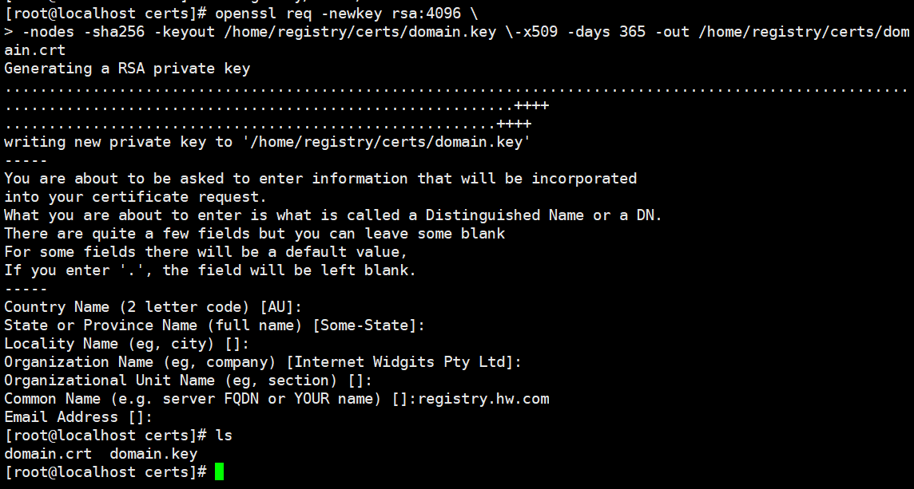
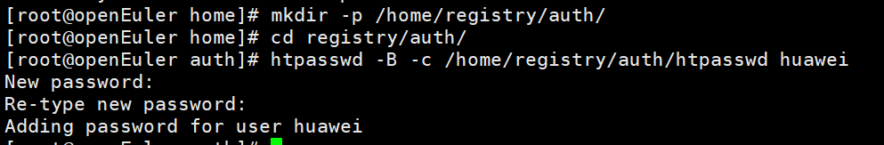
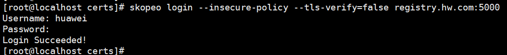

# 容器镜像签名验签

## skopeo编译安装

1.  下载skopeo。

    ```
    git clone -b v1.15.1 https://github.com/containers/skopeo.git $GOPATH/src/github.com/containers/skopeo
    ```

2.  下载编译依赖。

    ```
    yum install -y gpgme-devel device-mapper-devel
    ```

3.  编译安装。

    ```
    cd $GOPATH/src/github.com/containers/skopeo && make bin/skopeo
    cp bin/skopeo /usr/local/bin
    ```

4.  测试拉取镜像到本地，可以看到镜像被成功拉取。

    ```
    mkdir -p /home/work/images && cd /home/work/images
    skopeo copy --insecure-policy   
    docker://docker.io/library/busybox:latest dir:busybox:latest
    ```

    

    > **说明：** 
    >skopeo默认读取$HOME/.config/containers/policy.json或/etc/containers/policy.json的策略文件，根据文件中定制的镜像签名验证策略来验证镜像的合法性。策略格式和要求与[指定镜像仓的验证策略](#li395515366199)相同，部署验证阶段可通过--insecure-policy参数忽略验证策略。生产环境下请根据实际需求进行配置，并删除--insecure-policy参数。

## docker本地仓搭建

> **说明：** 
>docker依赖会和containerd依赖冲突，建议基于另一台服务器搭建docker本地仓。

1.  安装docker。

    ```
    yum install -y docker httpd-tools
    ```

2.  启动docker服务，并设置开机自启。

    ```
    systemctl start docker
    systemctl enable docker
    ```

3.  配置docker镜像源。

    ```
    vim /etc/docker/daemon.json
    
    {
      "registry-mirrors": [
            "https://registry.docker-cn.com",
            "http://hub-mirror.c.163.com"
      ],
     
      "dns": [
        "114.114.114.114",
        "110.110.110.110",
        "8.8.8.8"
      ]
    }
    ```

4.  配置docker代理。

    ```
    mkdir -p /etc/systemd/system/docker.service.d
    vim /etc/systemd/system/docker.service.d/http-proxy.conf
    ```

5.  配置代理IP。

    ```
    [Service]
    Environment="HTTP_PROXY=http://proxy.example.com:port/"
    Environment="HTTPS_PROXY=https://proxy.example.com:port/"
    ```

    > **说明：** 
    >若HTTPS\_PROXY字段没有可用的https代理，可使用http作为替代。

6.  重启docker。

    ```
    systemctl daemon-reload
    systemctl restart docker
    ```

7.  拉取registry镜像。

    ```
    docker pull registry:2
    ```

8.  配置https证书，设置镜像仓域名。

    ```
    mkdir -p /home/registry/certs
    openssl req -newkey rsa:4096 \
    -addext "subjectAltName = DNS:registry.hw.com" \
    -nodes -sha256 -keyout /home/registry/certs/domain.key \
    -x509 -days 365 -out /home/registry/certs/domain.crt
    ```

    设置域名registry.hw.com，其他可直接回车跳过。

    

    设置docker本地仓所在服务器的域名IP。

    ```
    vim /etc/hosts
    127.0.0.1 registry.hw.com
    ```

    > **说明：** 
    >外部服务器访问私有仓请配置私有仓所在服务器IP，内网部署请及时取消代理。

9.  将镜像仓证书写入docker本地仓所在服务器根证书。

    ```
    cat /home/registry/certs/domain.crt >>/etc/pki/ca-trust/extracted/pem/tls-ca-bundle.pem
    cat /home/registry/certs/domain.crt >>/etc/pki/ca-trust/extracted/openssl/ca-bundle.trust.crt
    ```

    > **说明：** 
    >拷贝domain.crt到机密容器执行服务器，执行下方命令将domain.crt追加到tls-ca-bundle.pem和ca-bundle.trust.crt。
    >```
    >cat /home/registry/certs/domain.crt >>/etc/pki/ca-trust/extracted/pem/tls-ca-bundle.pem
    >cat /home/registry/certs/domain.crt >>/etc/pki/ca-trust/extracted/openssl/ca-bundle.trust.crt
    >```

10. 返回到机密容器执行服务器，将本地仓证书写入guest，并修改guest的域名IP。
    1.  挂载rootfs镜像。

        ```
        cd /home/work/kata-containers/tools/osbuilder/rootfs-builder/
        mount rootfs.img rootfs
        ```

    2.  将本地仓证书追加到rootfs根证书。

        ```
        cat domain.crt >> rootfs/etc/pki/ca-trust/extracted/pem/tls-ca-bundle.pem
        cat domain.crt >> rootfs/etc/pki/ca-trust/extracted/openssl/ca-bundle.trust.crt
        ```

    3.  修改guest的域名配置文件，保证guest能解析docker本地镜像仓ip。

        ```
        vim rootfs/etc/hosts
        docker本地仓所在服务器IP registry.hw.com
        ```

    4.  取消挂载。

        ```
        umount rootfs
        ```

    5.  回到docker本地仓所在服务器，执行后续步骤。

11. 执行以下命令生成registry登录密码。

    ```
    mkdir -p /home/registry/auth/
    htpasswd -B -c /home/registry/auth/htpasswd <用户名>
    ```

    

12. 运行registry容器。

    ```
    docker run -d -p 5000:5000 \
    --restart=always \
    --name registry.hw.com \
    -v /home/registry/auth:/auth \
    -v /home/registry/certs:/certs \
    -e REGISTRY_HTTP_TLS_CERTIFICATE=/certs/domain.crt \
    -e REGISTRY_HTTP_TLS_KEY=/certs/domain.key \
    -v /home/registry/data:/var/lib/registry \
    -e "REGISTRY_AUTH=htpasswd" \
    -e "REGISTRY_AUTH_HTPASSWD_REALM=Registry Realm" \
    -e REGISTRY_AUTH_HTPASSWD_PATH=/auth/htpasswd \
    registry:2
    ```

    执行下方命令可查看正在运行的registry容器。

    ```
    docker ps
    ```

    

13. 测试镜像仓运行情况。
    1.  使用skopeo登录本地仓，执行以下命令后输入用户名和密码。

        ```
        skopeo login  --insecure-policy registry.hw.com:5000
        ```

        

    2.  使用skopeo上传之前下载的本地镜像测试。

        ```
        cd /home/work/images
        skopeo copy --insecure-policy  dir:busybox:latest docker://registry.hw.com:5000/busybox:latest
        ```

        > **说明：** 
        >该步骤需使用[skopeo编译安装](#section1967520191014)章节[步骤4](#li98111624578)下载的本地镜像进行测试。

    3.  执行以下命令，按照提示输入镜像仓密码，检查镜像上库情况。

        ```
        curl -u 用户名 https://registry.hw.com:5000/v2/_catalog
        ```

## 通过rvps工具添加RIM基线值

```
cd /home/coco/remote_attestation
cat << EOF > sample
{
    "virtcca.realm.rim": [
        "0f7733fcbaa9059d4d579fab25743868a2b4027290b09dfbc59964fc4b642kkk",
        "0f7733fcbaa9059d4d579fab25743868a2b4027290b09dfbc59964fc4b64207b"
    ]
}
EOF
provenance=$(cat sample | base64 --wrap=0)
cat << EOF > message
{
    "version" : "0.1.0",
    "type": "sample",
    "payload": "$provenance"
}
EOF
./rvps-tool register --path ./message --addr http://127.0.0.1:50003
```

> **说明：** 
>virtcca.realm.rim 添加的RIM基线值（列表）可通过基线值生成工具生成。

## 容器镜像签名验签

> CoCo社区参考文档：https://confidentialcontainers.org/docs/features/signed-images/

### 安装cosign工具并签名镜像

```shell
# 生成密钥对(两次回车可无需设置密码，用户视自身诉求而定)
cosign generate-key-pair

# --tlog-upload=false表示不上传到cosign官方（即离线签名，用户视自身诉求而定）
cosign sign --key cosign.key --tlog-upload=false registry.hw.com:5000/busybox:latest
离线签名，

# 部署签名公钥
mkdir -p /opt/confidential-containers/kbs/repository/default/cosign-key
cp ./cosign.pub /opt/confidential-containers/kbs/repository/default/cosign-key/1
```

### 拉取签名镜像并验签启动容器

签名验签demo：

```yaml
apiVersion: v1
kind: Pod
metadata:
  name: sign-test
  annotations:
    io.containerd.cri.runtime-handler: "kata-qemu-virtcca"
    io.katacontainers.config.hypervisor.kernel_params: "agent.debug_console agent.log=debug agent.image_policy_file=kbs:///default/security-policy/test agent.enable_signature_verification=true agent.guest_components_rest_api=all agent.aa_kbc_params=cc_kbc::http:90.90.25.90:8080"
spec:
  runtimeClassName: kata-qemu-virtcca
  terminationGracePeriodSeconds: 5
  containers:
  - name: box
    image: registry.hw.com:5000/busybox:latest
    imagePullPolicy: Always
    command:
      - sh
    tty: true

```

> 90.90.25.90:8080 即部署的远程证明组件kbs的IP和端口，用户视实际情况修改。