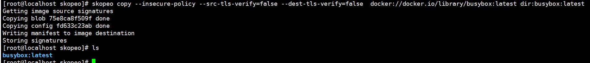

# 容器镜像签名验签

## skopeo编译安装

1.  下载skopeo。

    ```
    git clone -b v1.15.1 https://github.com/containers/skopeo.git $GOPATH/src/github.com/containers/skopeo
    ```

2.  下载编译依赖。

    ```
    yum install -y gpgme-devel device-mapper-devel
    ```

3.  编译安装。

    ```
    cd $GOPATH/src/github.com/containers/skopeo && make bin/skopeo
    cp bin/skopeo /usr/local/bin
    ```

4.  测试拉取镜像到本地，可以看到镜像被成功拉取。

    ```
    mkdir -p /home/work/images && cd /home/work/images
    skopeo copy --insecure-policy   
    docker://docker.io/library/busybox:latest dir:busybox:latest
    ```

    

    > **说明：** 
    >skopeo默认读取$HOME/.config/containers/policy.json或/etc/containers/policy.json的策略文件，根据文件中定制的镜像签名验证策略来验证镜像的合法性。策略格式和要求与[指定镜像仓的验证策略](#li395515366199)相同，部署验证阶段可通过--insecure-policy参数忽略验证策略。生产环境下请根据实际需求进行配置，并删除--insecure-policy参数。

## 通过rvps工具添加RIM基线值

```
cd /home/coco/remote_attestation
cat << EOF > sample
{
    "virtcca.realm.rim": [
        "0f7733fcbaa9059d4d579fab25743868a2b4027290b09dfbc59964fc4b642kkk",
        "0f7733fcbaa9059d4d579fab25743868a2b4027290b09dfbc59964fc4b64207b"
    ]
}
EOF
provenance=$(cat sample | base64 --wrap=0)
cat << EOF > message
{
    "version" : "0.1.0",
    "type": "sample",
    "payload": "$provenance"
}
EOF
./rvps-tool register --path ./message --addr http://127.0.0.1:50003
```

> **说明：** 
>virtcca.realm.rim 添加的RIM基线值（列表）可通过基线值生成工具生成。

## 容器镜像签名验签

> CoCo社区参考文档：https://confidentialcontainers.org/docs/features/signed-images/

### 安装cosign工具并签名镜像

```shell
# 生成密钥对(两次回车可无需设置密码，用户视自身诉求而定)
cosign generate-key-pair

# --tlog-upload=false表示不上传到cosign官方（即离线签名，用户视自身诉求而定）
cosign sign --key cosign.key --tlog-upload=false registry.hw.com:5000/busybox:latest
离线签名，

# 部署签名公钥
mkdir -p /opt/confidential-containers/kbs/repository/default/cosign-key
cp ./cosign.pub /opt/confidential-containers/kbs/repository/default/cosign-key/1
```

### 拉取签名镜像并验签启动容器

签名验签demo：

```yaml
apiVersion: v1
kind: Pod
metadata:
  name: sign-test
  annotations:
    io.containerd.cri.runtime-handler: "kata-qemu-virtcca"
    io.katacontainers.config.hypervisor.kernel_params: "agent.debug_console agent.log=debug agent.image_policy_file=kbs:///default/security-policy/test agent.enable_signature_verification=true agent.guest_components_rest_api=all agent.aa_kbc_params=cc_kbc::http:90.90.25.90:8080"
spec:
  runtimeClassName: kata-qemu-virtcca
  terminationGracePeriodSeconds: 5
  containers:
  - name: box
    image: registry.hw.com:5000/busybox:latest
    imagePullPolicy: Always
    command:
      - sh
    tty: true

```

> 90.90.25.90:8080 即部署的远程证明组件kbs的IP和端口，用户视实际情况修改。
