# 机密容器支持SRIOV

## 编译guest Image

1.  机密容器执行环境，进到guest kernel源码目录并删除裁剪版配置。

    ```
    cd /home/coco/guest/kernel && rm -rf .config
    ```

2.  生成默认配置。
    1.  进入“kernel“目录并修改deconfig。

        ```
        vim arch/arm64/configs/openeuler_defconfig
        ```

    2.  确保编译选项修改为如下形式。

        ```
        CONFIG_NET_9P=y
        CONFIG_NET_9P_VIRTIO=y
        CONFIG_VIRTIO_BLK=y
        CONFIG_SCSI_VIRTIO=y
        CONFIG_VIRTIO_NET=y
        CONFIG_VIRTIO=y
        CONFIG_VIRTIO_PCI_LIB=y
        CONFIG_VIRTIO_PCI=y
        CONFIG_EXT4_FS=y
        # CONFIG_DEBUG_INFO_BTF is not set
        CONFIG_SOFTLOCKUP_DETECTOR=y
        CONFIG_LOCKUP_DETECTOR=y
        CONFIG_PREEMPT_NONE=y
        ```

    3.  修改Kconfig。
        1.  修改/block/Kconfig文件。
            1.  打开drivers/block/Kconfig文件。

                ```
                vim drivers/block/Kconfig
                ```

            2.  按“i“进入编辑模式，修改tristate“Virtio block driver”为如下。

                ```
                bool "Virtio block driver"
                ```

                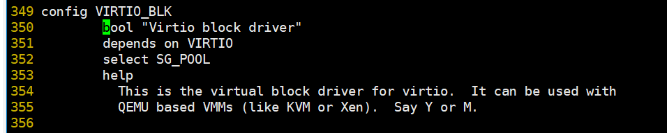

            3.  按“Esc“键退出编辑模式，输入**:wq!**，按“Enter“键保存并退出文件。

        2.  修改drivers/net/Kconfig文件。
            1.  打开drivers/net/Kconfig文件。

                ```
                vim drivers/net/Kconfig
                ```

            2.  修改tristate“Virtio network driver”为如下。

                ```
                bool "Virtio network driver"
                ```

                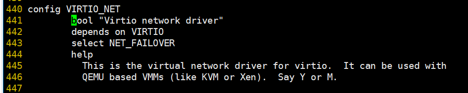

            3.  按“Esc“键退出编辑模式，输入**:wq!**，按“Enter“键保存并退出文件。

        3.  修改drivers/virtio/Kconfig文件。
            1.  打开drivers/virtio/Kconfig文件。

                ```
                vim drivers/virtio/Kconfig
                ```

            2.  按“i“进入编辑模式，将config VIRTIO\_PCI\_LIB下的tristate改为bool。

                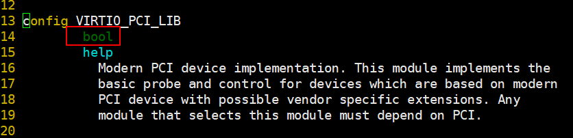

            3.  修改tristate“PCI driver for virtio devices”为如下。

                ```
                bool "PCI driver for virtio devices"
                ```

                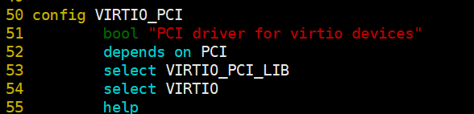

            4.  按“Esc“键退出编辑模式，输入**:wq!**，按“Enter“键保存退出文件。

    4.  生成.config配置文件。

        ```
        make openeuler_defconfig
        ```

3.  加入NVMe盘和网卡驱动相关的配置。开启BLK\_DEV\_NVME、NVME\_CORE、VXLAN、MLXFW、IOMMUFD、VFIO、MLX5\_VFIO\_PCI和MLX5\_CORE等编译选项。开启CONFIG\_VSOCKETS、CONFIG\_VIRTIO\_VSOCKETS、CONFIG\_9P\_FS和CONFIG_VIRTIO_FS以支持启动机密容器。
    1.  执行以下命令打开menuconfig。

        ```
        make menuconfig
        ```

    2.  在menuconfig界面输入"/"跳转至搜索界面，在搜索界面输入要开启的编译选项后按**Enter**键进行搜索。

        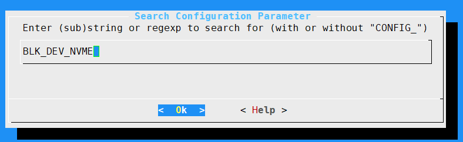

    3.  搜索完成后，输入**1**打开依赖选项（此案例中的依赖选项为NVME\_CORE）。

        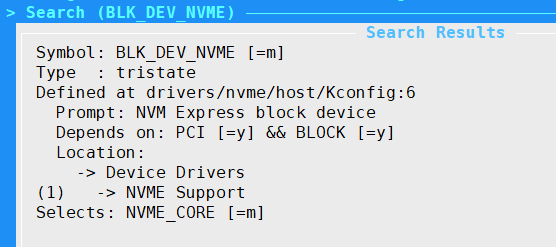

    4.  按“space“键将NVME\_CORE的模式由"**M**"设置为"**\***"。设置完成后便开启了NVME\_CORE。

        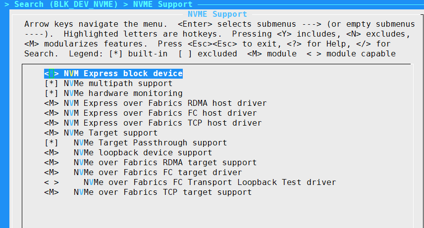

    5.  按两次“Esc“键退出至上一级。

        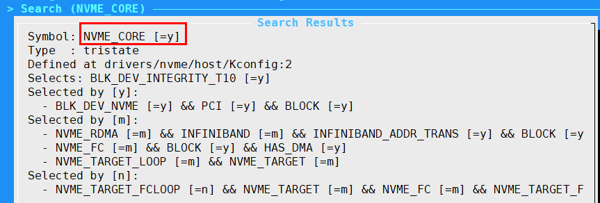

    6.  打开依赖选项后开启了BLK\_DEV\_NVME。

        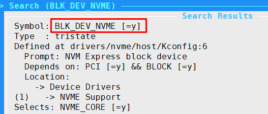

    7.  相同操作逻辑打开NVME\_CORE等编译选项，按两次"Esc"键退至上一级，直至保存设置并推出。

4.  编译guest镜像。

    ```
    export LOCALVERSION=
    make include/config/kernel.release
    make -j$(nproc)
    ```

    目标镜像文件即：/home/coco/guest/kernel/arch/arm64/boot/Image。

## 创建vfio设备

1.  `VirtCCA`设备直通环境配置。
    1）修改内核启动参数
	vim /boot/efi/EFI/openEuler/grub.cfg
	Host OS内核启动参数添加：`virtcca_cvm_host=1 arm_smmu_v3.disable_ecmdq=1 vfio_pci.disable_idle_d3=1`
    2）BIOS使能SMMU
	BIOS用户界面路径：`Advanced > MISC Config > Support Smmu`，设置`Support Smmu`为`Enabled`
2.  当前以网卡为例给出创建VF并绑定vfio驱动操作。
    1.  查看ConnectX-6网卡的BDF号。

        lspci -tv | grep ConnectX-6

        domin为0000，两个BDF号分别为ab:00.0和ab:00.1。

        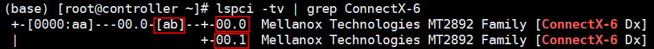

    2.  获取BDF号对应的网卡名称。

        ll /sys/class/net/ | grep ab:00.0

        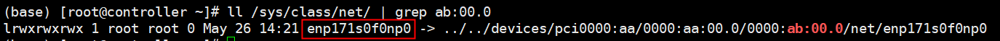

    3.  创建VF设备，VF\_NUM数量用户按需自行决定。

        echo $\{VF\_NUM\} \> /sys/class/net/enp171s0f0np0/device/sriov\_numvfs

        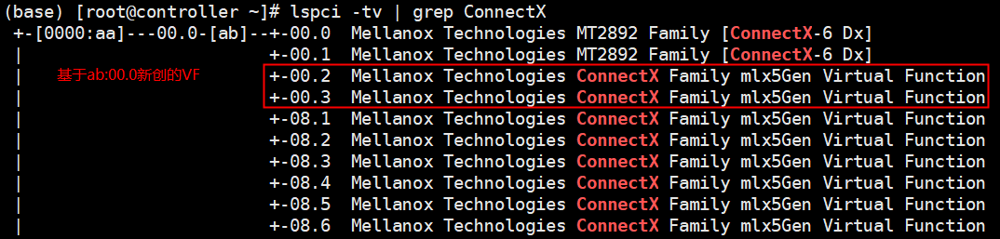

    4.  将待直通的VF从内核默认网络驱动解绑。

        echo 0000:ab:00.2 \> /sys/bus/pci/devices/0000\\:ab\\:00.2/driver/unbind

        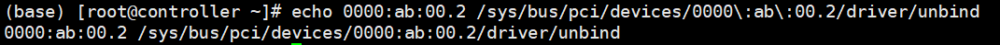

    5.  查看待直通VF的设备ID。

        lspci -ns ab:00.2

        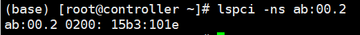

    6.  加载vfio驱动。

        modprobe vfio-pci

    7.  将前述获取的设备ID绑定到vfio驱动。

        echo 15b3 101e \> /sys/bus/pci/drivers/vfio-pci/new\_id

    8.  查看成功绑定的vfio设备。

        ll /dev/vfio/

        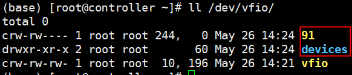

3.  修改ctr容器 配置文件支持vfio设备冷插拔。
    `vim /etc/kata-containers/configuration-qemu.toml`
    添加：`cold_plug_vfio = "root-port"`

4.  ctr启动机密容器时通过--device透传vfio设备。

    ctr run --runtime "io.containerd.kata.v2" --device /dev/vfio/91 --rm -t docker.io/library/busybox:latest kata-test /bin/sh

    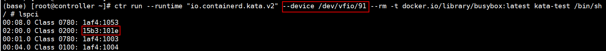

    容器中可以看到直通的VF设备ID。
