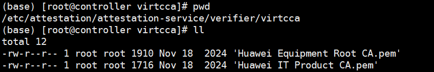
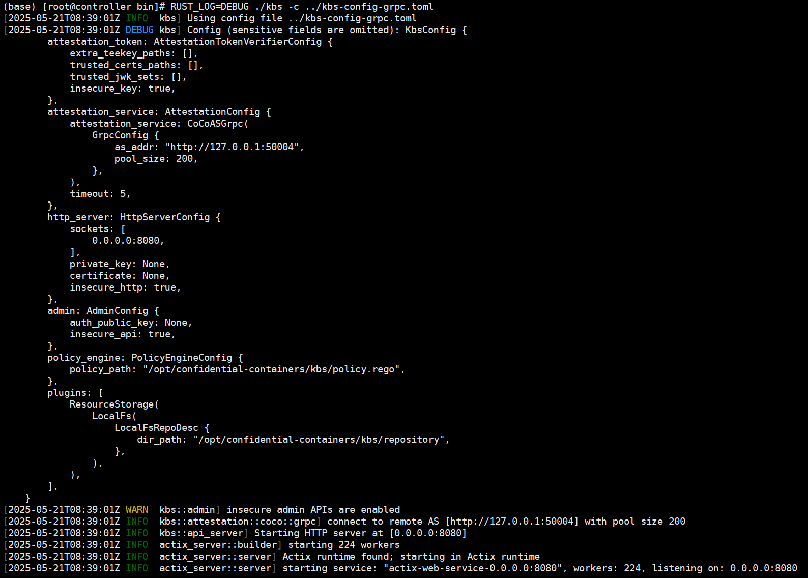
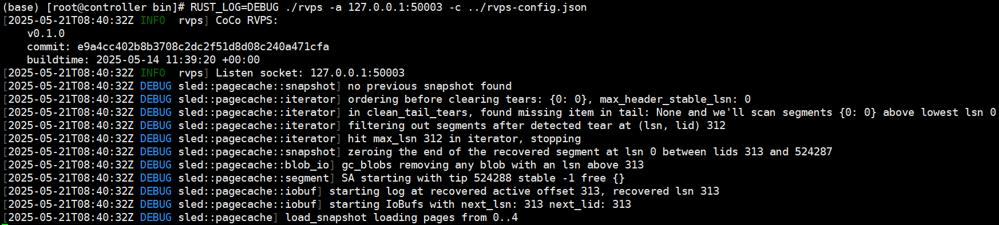
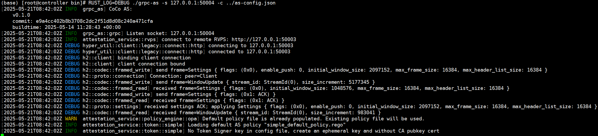

# 机密容器远程证明环境部署

- 下述远程证明组件参考[`容器化编译CoCo组件`](./容器化编译CoCo组件.md)章节完成编译。
- 下述远程证明组件服务均部署在同一台机器上（远程证明服务节点），每个服务的IP均使用的127.0.0.1本地回环地址，使用每个组件默认的端口，用户可根据实际需求决定每个组件服务的部署方式并修改对应IP和PORT，配置文件的详细配置规则可参考CoCo社区文档。

## 远程证明组件部署

1. 拷贝远程证明组件到目标目录。

	```shell
	mkdir -p /home/coco/remote_attestation
	cd /home/kata-containers/build/trustee/target/release
	cp grpc-as kbs rvps rvps-tool /home/coco/remote_attestation
	```

2. 配置远程证明组件启动依赖的配置文件。
   1.  进到目标目录。

       `cd /home/coco/remote_attestation`

   2.  配置kbs-config-grpc.toml文件。

       `vim kbs-config-grpc.toml`

       ```shell
       [http_server]
       sockets = ["0.0.0.0:8080"]
       insecure_http = true
       
       [attestation_token]
       insecure_key = true
       
       [attestation_service]
       type = "coco_as_grpc"
       as_addr = "http://127.0.0.1:50004"
       pool_size = 200
       
       [admin]
       insecure_api = true
       
       [[plugins]]
       name = "resource"
       type = "LocalFs"
       dir_path = "/opt/confidential-containers/kbs/repository"
       ```

   3.  配置rvps服务依赖的配置文件。

       `vim rvps-config.json`

       ```shell
       {
           "storage": {
               "type": "LocalFs",
               "file_path": "/opt/confidential-containers/attestation-service/rvps"
           }
       }
       ```

   4.  配置as服务依赖的配置文件。

       `vim as-config.json`

       ```shell
       {
           "work_dir": "/opt/confidential-containers/attestation-service",
           "policy_engine": "opa",
           "rvps_config": {
               "type": "GrpcRemote",
               "address": "http://127.0.0.1:50003"
           },
           "attestation_token_broker": {
           "type": "Simple",
               "duration_min": 5
           }
       }
       ```

   5.  配置验证VirtCCA度量报告的policy。

       mkdir -p /opt/confidential-containers/attestation-service/token/simple/policies/opa

       vim /opt/confidential-containers/attestation-service/token/simple/policies/opa/default.rego

       ```shell
       package policy
       import future.keywords.every
       import future.keywords.if
       default allow := false
       allow if {
           print("Full Input:", input)
           print("Rim:", input["virtcca.realm.rim"])
           print("Ref:", data.reference)
           input["virtcca.realm.rim"] in data.reference["virtcca.realm.rim"]
       }
       ```

   6.  远程证明服务节点预置远程证明根证书、二级CA证书文件。

       mkdir -p /etc/attestation/attestation-service/verifier/virtcca/ && cd /etc/attestation/attestation-service/verifier/virtcca/

       访问网站下载证书，并将证书放到当前目录，保持下载的证书名称不变。

       

       -   根证书下载链接：[https://download.huawei.com/dl/download.do?actionFlag=download&nid=PKI1000000002&partNo=3001&mid=SUP\_PKI](https://download.huawei.com/dl/download.do?actionFlag=download&nid=PKI1000000002&partNo=3001&mid=SUP_PKI)
       -   二级CA证书下载链接：[https://download.huawei.com/dl/download.do?actionFlag=download&nid=PKI1000000040&partNo=3001&mid=SUP\_PKI](https://download.huawei.com/dl/download.do?actionFlag=download&nid=PKI1000000040&partNo=3001&mid=SUP_PKI)

3. 启动kbs、rvps和as常驻服务。
   1.  启动kbs。

       RUST_LOG=DEBUG ./kbs -c ./kbs-config-grpc.toml

       

   2.  启动rvps。

       RUST_LOG=DEBUG ./rvps -a 127.0.0.1:50003 -c ./rvps-config.json

       

   3.  启动as。

       RUST_LOG=DEBUG ./grpc-as -s 127.0.0.1:50004 -c ./as-config.json

       

