## 部署containerd

1.  下载containerd 1.7.27。

    ```
    wget https://github.com/containerd/containerd/releases/download/v1.7.27/containerd-1.7.27-linux-arm64.tar.gz
    ```

2.  解压获取可执行文件。

    ```
    tar -xvf containerd-1.7.27-linux-arm64.tar.gz
    ```

    解压产物如下：

    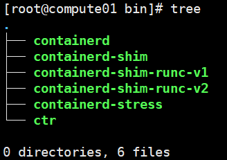

3.  拷贝可执行文件到“/usr/local/bin“目录下。

    ```
    cp bin/*  /usr/local/bin
    ```

4.  安装runc。

    ```
    yum install runc -y
    ```

5.  生成containerd配置文件。

    ```
    mkdir /etc/containerd/
    containerd config default > /etc/containerd/config.toml
    ```

6.  在配置文件中新增如下字段。

    ```
    [plugins."io.containerd.grpc.v1.cri".containerd.runtimes.kata]
              runtime_type = "io.containerd.kata.v2"
              privileged_without_host_devices = false
    ```

    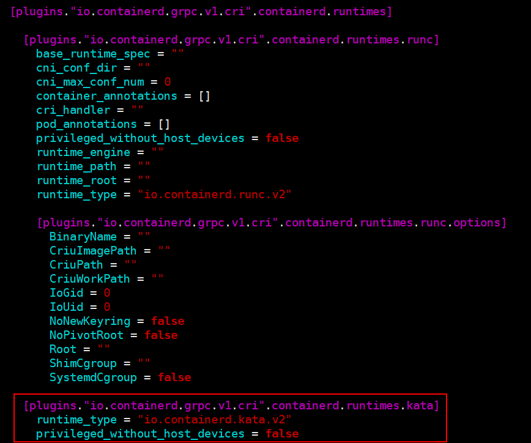

7.  修改配置文件中sandbox\_image版本修改为3.10。

    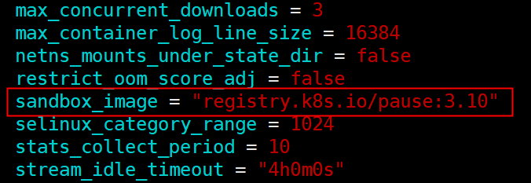

8.  安装containerd.service。

    ```
    wget https://raw.githubusercontent.com/containerd/containerd/refs/tags/v1.7.27/containerd.service
    cp ./containerd.service  /usr/lib/systemd/system/
    ```

9.  Containerd代理配置。

    > **说明：** 
    >若部署环境直通公网，则可跳过当前步骤。

    1.  创建目录。

        ```
        mkdir -p /etc/systemd/system/containerd.service.d/
        ```

    2.  打开配置文件。

        ```
        vim /etc/systemd/system/containerd.service.d/http-proxy.conf
        ```

    3.  按“i”进入编辑模式，增加如下内容。

        ```
        [Service]
        Environment="HTTP_PROXY=代理服务器"
        Environment="HTTPS_PROXY=代理服务器"
        Environment="NO_PROXY=localhost,registry.hw.com"
        ```

    > **说明：** 
    >此处的registry.hw.com是验证远程证明特性时搭建的docker本地镜像仓域名，用户按需修改。

10. 启动containerd。

    ```
    systemctl daemon-reload
    systemctl start containerd
    systemctl enable containerd
    ```

    查看containerd服务是否正常启动。

    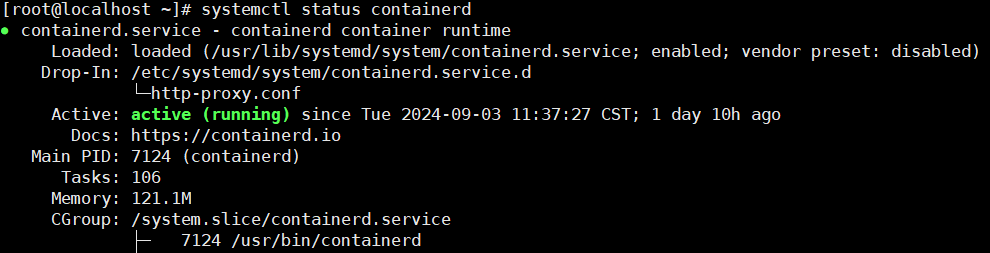

11. 通过containerd命令行工具ctr启动容器。
    1.  拉取镜像。

        ```
        ctr image pull docker.io/library/busybox:latest
        ```

    2.  运行容器。
        -   运行一个容器，未指定runtime，默认为runc。

            ```
            ctr run --rm -t docker.io/library/busybox:latest test-kata /bin/sh
            ```

            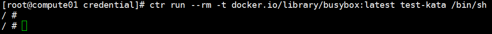

## 部署K8s（单节点）

1.  新增yum源。
    1.  新建K8s.repo文件。

        ```
        vim /etc/yum.repos.d/k8s.repo
        ```

    2.  按“i”进入编辑模式，增加如下内容。

        ```
        [k8s]
        name=Kubernetes
        baseurl=https://pkgs.k8s.io/core:/stable:/v1.32/rpm/
        enabled=1
        gpgcheck=0
        repo_gpgcheck=0
        ```

    3.  更新yum源。

        ```
        yum clean all
        yum makecache
        ```

2.  安装K8s组件。

    ```
    yum install -y kubelet kubeadm kubectl kubernetes-cni --nobest
    ```

3.  添加系统配置。
    1.  关闭防火墙。

        ```
        systemctl stop firewalld && systemctl disable firewalld
        ```

        > **说明：** 
        >通过关闭防火墙来确保k8s组件之间能正常通讯，仅建议调试环境使用这种方式，生产环境建议配置防火墙规则来确保通讯正常。

    2.  加载内核模块。

        ```
        modprobe br_netfilter
        ```

    3.  启用NET.BRIDGE.BRIDGE-NF-CALL-IPTABLES内核选项。

        ```
        sysctl -w net.bridge.bridge-nf-call-iptables=1
        ```

    4.  禁用交换分区。

        ```
        swapoff -a
        cp -p /etc/fstab /etc/fstab.bak$(date '+%Y%m%d%H%M%S')
        sed -i "s/\/dev\/mapper\/openeuler-swap/\#\/dev\/mapper\/openeuler-swap/g" /etc/fstab
        ```

        > **说明：** 
        >当前openEuler系统重启后会自动恢复交换分区功能，导致当服务器重启后k8s服务无法开机启动，需手动执行禁用交换分区命令。

    5.  设置kubelet服务开机自启动。

        ```
        systemctl enable kubelet
        ```

4.  初始化K8s集群。
    1.  删除代理。

        ```
        export -n http_proxy
        export -n https_proxy
        export -n no_proxy
        ```

    2.  创建/etc/resolv.conf并修改/etc/hosts。

        ```
        touch /etc/resolv.conf && echo "$(hostname -I | awk '{print $1}') node" | sudo tee -a /etc/hosts
        ```
    3.  生成初始化配置。

        ```
        kubeadm config print init-defaults > kubeadm-init.yaml
        ```

    4.  在kubeadm-init.yaml同级目录生成配置脚本。

        ```
        vim update_kubeadm_init.sh
        ```

        ```
        #!/bin/bash
        
        IP_ADDRESS=$(hostname -I | awk '{print $1}')
        CONFIG_FILE="kubeadm-init.yaml"
        
        sed -i "s/^  advertiseAddress: .*/  advertiseAddress: ${IP_ADDRESS}/" "$CONFIG_FILE"
        sed -i "s|criSocket: unix:///var/run/containerd/containerd.sock|criSocket: unix:///run/containerd/containerd.sock|" "$CONFIG_FILE"
        sed -i "s/^kubernetesVersion: .*/kubernetesVersion: 1.32.4/" "$CONFIG_FILE"
        sed -i '/serviceSubnet: 10.96.0.0\/12/a\  podSubnet: 10.244.0.0/16' "$CONFIG_FILE"
        sed -i '/imagePullSerial: true/d' "$CONFIG_FILE"
        
        cat <<EOF >> "$CONFIG_FILE"
        ---
        kind: KubeletConfiguration
        apiVersion: kubelet.config.k8s.io/v1beta1
        cgroupDriver: cgroupfs
        EOF
        ```

    5.  在kubeadm-init.yaml同级目录执行如下命令。

        ```
        chmod 755 update_kubeadm_init.sh
        ./update_kubeadm_init.sh
        ```

        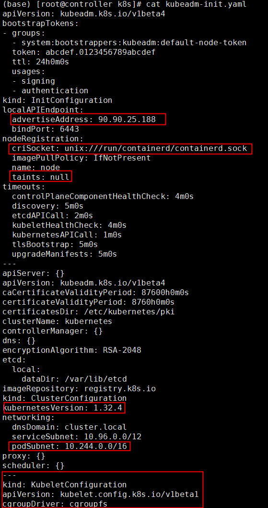

    6.  执行以下命令将K8s节点进行复位，在交互栏输入**y**完成复位。

        ```
        kubeadm reset
        ```

        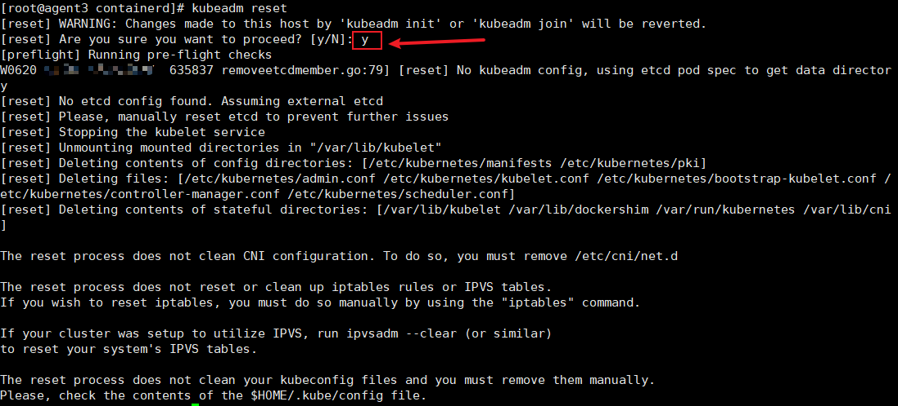

        > **说明：** 
        >1.  K8s二次部署过程中，若执行** kubeadm reset**  命令报错 etcdserver: re-configuration failed due to not enough started members，可执行以下命令进行解决。
        >    ```
        >    rm -rf /etc/kubernetes/*
        >    rm -rf /root/.kube/
        >    ```
        >    之后重新执行**kubeadm reset**命令
        >2.  K8s调度策略会检查结点运行状态，当节点根目录磁盘占用超过85%时将节点驱逐，导致节点不可用，请在正式部署前检查机器根目录存储状况，预留足够空间。
        >    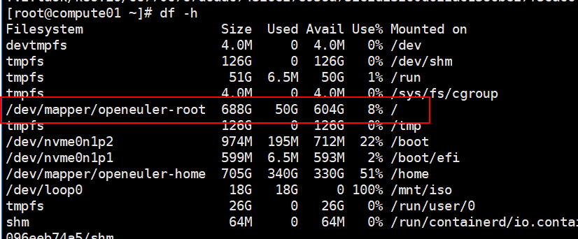
        >    为保证节点可用性，可配置containerd容器运行空间，根据实际情况修改root选项对应的路径。
        >    ```
        >    vim /etc/containerd/config.toml
        >    root = "/home/kata/var/lib/containerd"
        >    :wq
        >    ```
        >    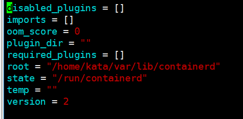

    7.  初始化K8s节点。

        ```
        kubeadm init --config kubeadm-init.yaml
        ```

        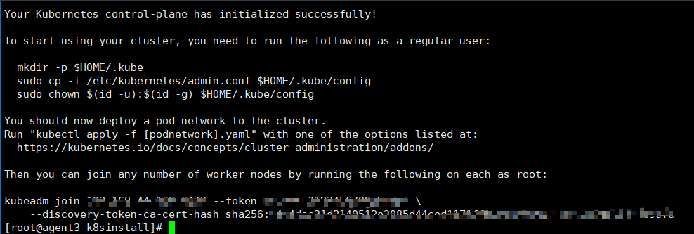

        > **说明：** 
        >K8s节点初始化过程中，若出现报错：\[kubelet-check\] Initial timeout of 40s passed。
        >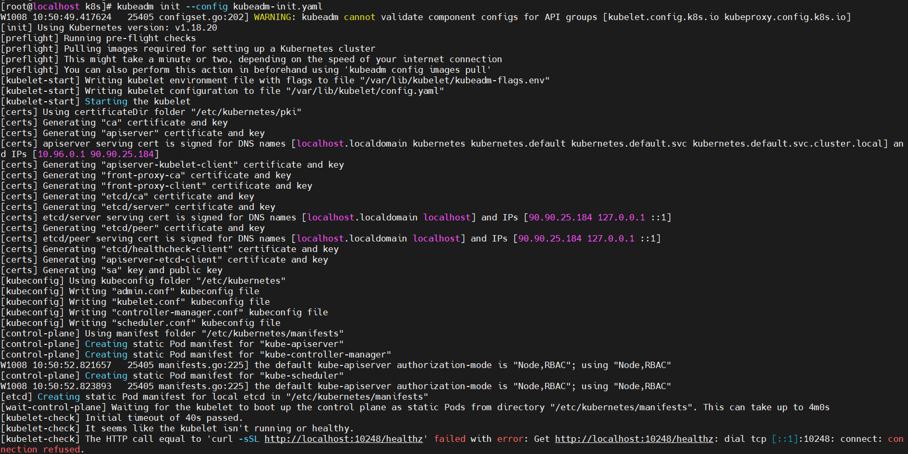
        >可通过执行以下命令解决：
        >```
        >kubeadm reset
        >rm -rf /var/lib/etcd
        >iptables -F && iptables -t nat -F && iptables -t mangle -F
        >```
        >之后重新执行指令：
        >```
        >kubeadm init --config kubeadm-init.yaml
        >```

    8.  创建配置，导出环境变量。

        ```
        mkdir -p $HOME/.kube
        cp -i /etc/kubernetes/admin.conf $HOME/.kube/config
        chown $(id -u):$(id -g) $HOME/.kube/config
        export KUBECONFIG=/etc/kubernetes/admin.conf
        ```

    9.  写入K8s配置路径到文件。

        ```
        vim /etc/profile
        export KUBECONFIG=/etc/kubernetes/admin.conf
        ```

5.  安装flannel插件。
    1.  下载并安装cni相关插件。

        ```
        wget https://github.com/containernetworking/plugins/releases/download/v1.5.1/cni-plugins-linux-arm64-v1.5.1.tgz
        tar -C /opt/cni/bin -zxvf cni-plugins-linux-arm64-v1.5.1.tgz
        ```

    2.  新建kube-flannel.yaml文件。

        ```
        vim kube-flannel.yaml
        ```

    3.  按“i”进入编辑模式，增加如下内容。

        ```
        ---
        kind: Namespace
        apiVersion: v1
        metadata:
          name: kube-flannel
          labels:
            k8s-app: flannel
            pod-security.kubernetes.io/enforce: privileged
        ---
        kind: ClusterRole
        apiVersion: rbac.authorization.k8s.io/v1
        metadata:
          labels:
            k8s-app: flannel
          name: flannel
        rules:
        - apiGroups:
          - ""
          resources:
          - pods
          verbs:
          - get
        - apiGroups:
          - ""
          resources:
          - nodes
          verbs:
          - get
          - list
          - watch
        - apiGroups:
          - ""
          resources:
          - nodes/status
          verbs:
          - patch
        - apiGroups:
          - networking.k8s.io
          resources:
          - clustercidrs
          verbs:
          - list
          - watch
        ---
        kind: ClusterRoleBinding
        apiVersion: rbac.authorization.k8s.io/v1
        metadata:
          labels:
            k8s-app: flannel
          name: flannel
        roleRef:
          apiGroup: rbac.authorization.k8s.io
          kind: ClusterRole
          name: flannel
        subjects:
        - kind: ServiceAccount
          name: flannel
          namespace: kube-flannel
        ---
        apiVersion: v1
        kind: ServiceAccount
        metadata:
          labels:
            k8s-app: flannel
          name: flannel
          namespace: kube-flannel
        ---
        kind: ConfigMap
        apiVersion: v1
        metadata:
          name: kube-flannel-cfg
          namespace: kube-flannel
          labels:
            tier: node
            k8s-app: flannel
            app: flannel
        data:
          cni-conf.json: |
            {
              "name": "cbr0",
              "cniVersion": "0.3.1",
              "plugins": [
                {
                  "type": "flannel",
                  "delegate": {
                    "hairpinMode": true,
                    "isDefaultGateway": true
                  }
                },
                {
                  "type": "portmap",
                  "capabilities": {
                    "portMappings": true
                  }
                }
              ]
            }
          net-conf.json: |
            {
              "Network": "10.244.0.0/16",
              "Backend": {
                "Type": "vxlan"
              }
            }
        ---
        apiVersion: apps/v1
        kind: DaemonSet
        metadata:
          name: kube-flannel-ds
          namespace: kube-flannel
          labels:
            tier: node
            app: flannel
            k8s-app: flannel
        spec:
          selector:
            matchLabels:
              app: flannel
          template:
            metadata:
              labels:
                tier: node
                app: flannel
            spec:
              affinity:
                nodeAffinity:
                  requiredDuringSchedulingIgnoredDuringExecution:
                    nodeSelectorTerms:
                    - matchExpressions:
                      - key: kubernetes.io/os
                        operator: In
                        values:
                        - linux
              hostNetwork: true
              priorityClassName: system-node-critical
              tolerations:
              - operator: Exists
                effect: NoSchedule
              serviceAccountName: flannel
              initContainers:
              - name: install-cni-plugin
                image: docker.io/flannel/flannel-cni-plugin:v1.2.0
                command:
                - cp
                args:
                - -f
                - /flannel
                - /opt/cni/bin/flannel
                volumeMounts:
                - name: cni-plugin
                  mountPath: /opt/cni/bin
              - name: install-cni
                image: docker.io/flannel/flannel:v0.22.3
                command:
                - cp
                args:
                - -f
                - /etc/kube-flannel/cni-conf.json
                - /etc/cni/net.d/10-flannel.conflist
                volumeMounts:
                - name: cni
                  mountPath: /etc/cni/net.d
                - name: flannel-cfg
                  mountPath: /etc/kube-flannel/
              containers:
              - name: kube-flannel
                image: docker.io/flannel/flannel:v0.22.3
                command:
                - /opt/bin/flanneld
                args:
                - --ip-masq
                - --kube-subnet-mgr
                resources:
                  requests:
                    cpu: "200m"
                    memory: "100Mi"
                securityContext:
                  privileged: false
                  capabilities:
                    add: ["NET_ADMIN", "NET_RAW"]
                env:
                - name: POD_NAME
                  valueFrom:
                    fieldRef:
                      fieldPath: metadata.name
                - name: POD_NAMESPACE
                  valueFrom:
                    fieldRef:
                      fieldPath: metadata.namespace
                - name: EVENT_QUEUE_DEPTH
                  value: "5000"
                volumeMounts:
                - name: run
                  mountPath: /run/flannel
                - name: flannel-cfg
                  mountPath: /etc/kube-flannel/
                - name: xtables-lock
                  mountPath: /run/xtables.lock
              volumes:
              - name: run
                hostPath:
                  path: /run/flannel
              - name: cni-plugin
                hostPath:
                  path: /opt/cni/bin
              - name: cni
                hostPath:
                  path: /etc/cni/net.d
              - name: flannel-cfg
                configMap:
                  name: kube-flannel-cfg
              - name: xtables-lock
                hostPath:
                  path: /run/xtables.lock
                  type: FileOrCreate
        ```

    4.  按“Esc”键，输入**:wq!**，按“Enter”保存并退出编辑。
    5.  启动flannel。

        ```
        kubectl apply -f kube-flannel.yaml
        ```

6.  检查集群状态。
    1.  短暂等待flannel部署完毕后，检查master节点状态为**Ready**。

        ```
        kubectl get nodes
        ```

        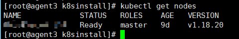

    2.  pod状态均为**Running**。

        ```
        kubectl get pods -A
        ```

        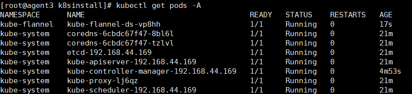


 **说明：** 

由于kubectl run命令启动容器并不支持指定容器运行时的类型，而/etc/containerd/config.toml中配置的默认容器运行时是**runc**，故kubectl run启动的是普通容器。建议用户通过Operator管理容器运行时并启动kata机密容器。强制修改/etc/containerd/config.toml中的默认容器运行时为**kata**将可能会导致安全内存占满，请谨慎操作。
