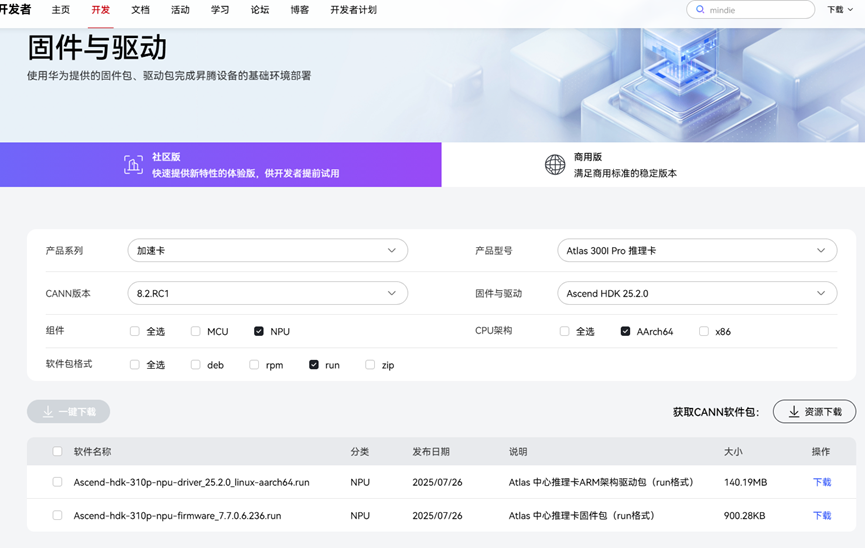
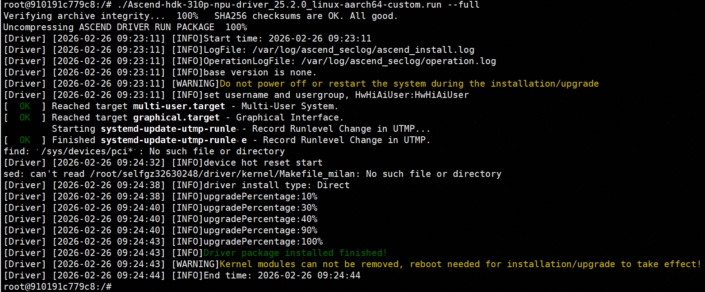
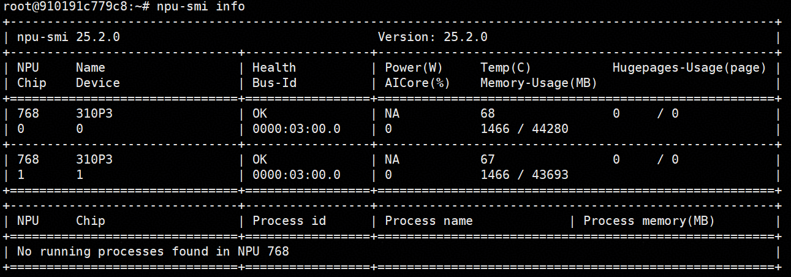
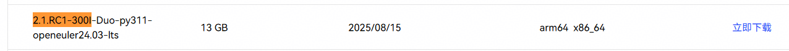
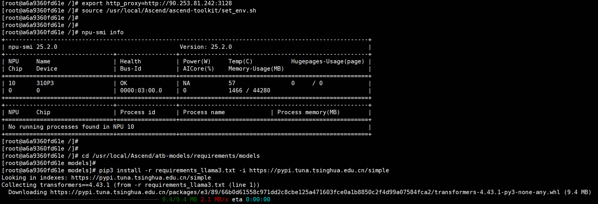
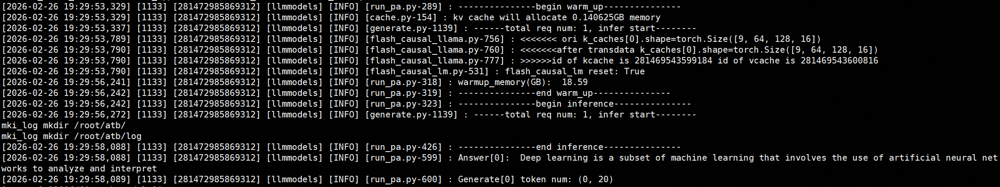
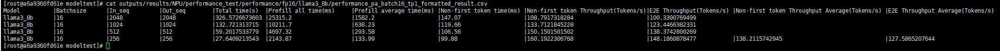

# 1. virtCCA环境准备

```shell
yum groupinstall "Development Tools"

# host kernel
git clone https://gitee.com/confidential_computing/kernel.git -b OLK-6.6 --depth 1
cd kernel
make openeuler_defconfig
make rpm-pkg -j64 LOCALVERSION="-virtCCA"
# 安装kernel、kernel-devel和kernel-headers
cd rpmbuild/RPMS/aarch64/
rpm -ivh *.rpm
reboot

# qemu
yum install ninja-build libcap-ng-devel libattr-devel glib2-devel numactl-devel libslirp-devel liburing-devel meson.noarch
git clone https://gitee.com/confidential_computing/qemu.git -b qemu-8.2.0 --depth 1
# configure
cd qemu/
rm -rf build && mkdir build
cd build/
../configure --target-list=aarch64-softmmu --cc="gcc" --extra-cflags="-Wno-error" --disable-docs --enable-virtfs --enable-numa --enable-slirp
# compile
make -j$(nproc)
```

# 2. Host安装驱动和固件

驱动软件和NPU硬件强相关，最好配套NPU固件程序一起安装，NPU固件只支持裸机下安装，NPU直通虚机后无法安装，务必在NPU直通虚机之前进行固件安装升级。

## 2.1 驱动和固件下载

[https://www.hiascend.com/hardware/firmware-drivers/community?product=2&model=15&cann=8.2.RC1&driver=Ascend+HDK+25.2.0](https://www.hiascend.com/hardware/firmware-drivers/community?product=2&model=15&cann=8.2.RC1&driver=Ascend+HDK+25.2.0)



## 2.2 安装

```shell
# 查看NPU是否可识别，Atlas 300I Pro为d500, Atlas 300I(3010)为d100
lspci | grep d500

# 创建用户
groupadd HwHiAiUser
useradd -g HwHiAiUser -d /home/HwHiAiUser -m HwHiAiUser -s /bin/bash

# 安装驱动，将固件和驱动拷贝至当前目录
chmod +x *.run
./Ascend-hdk-310p-npu-driver_25.2.0_linux-aarch64.run --noexec --extract=./hdk_src
./Ascend-hdk-310p-npu-driver_25.2.0_linux-aarch64.run --repack-path=./hdk_src
./Ascend-hdk-310p-npu-driver_25.2.0_linux-aarch64.run-custom.run –upgrade

./ Ascend-hdk-310p-npu-firmware_7.7.0.6.236.run --full
安装完成后重启, 重启后执行npu-smi info,查看驱动是否加载成功
```

# 3. 使用kata-deploy构建默认安装Ascend驱动的文件系统

> kata-deply镜像构建环境

## 3.1 源码及依赖文件准备

```shell
# 1. 进到执行 ./build.sh kdeploy 后的目标kata源码根目录
cd kata-containers

# 2. 拉取virtCCA_sdk最新代码
cd ./build/virtCCA_sdk
git pull
cd ..

# 3. apply 安装310P驱动的patch到kata源码
git apply ./build/virtCCA_sdk/kata-v3.15.0/feature/feat-enable-Ascend-310P/enable-Ascend-310P.patch

# 4. 拷贝hook脚本
cp ./build/virtCCA_sdk/kata-v3.15.0/feature/feat-enable-Ascend-310P/ascend_hook.sh ./build

# 5. 拷贝上文章节2.1中下载的昇腾驱动包到目标路径
cp ./Ascend-hdk-310p-npu-driver_25.2.0_linux-aarch64.run ./build

```

## 3.2 编译构建Ascend直通用到的rootfs和kernel

```shell
cd ./tools/packaging/kata-deploy/local-build
rm -rf build
export USE_CACHE=no
export AGENT_POLICY=no
make rootfs-ascend-image-confidential-tarball
```

## 3.3 拷贝编译产物到目标执行机器，用于CVM的直接启动

```shell
# 拷贝已安装Ascend驱动的rootfs到目标目录
cp ./build/rootfs-ascend-image-confidential/destdir/opt/kata/share/kata-containers/kata-ubuntu-noble-ascend-confidential.image  xxx/Ascend/

# 拷贝配套kernel Image到目标目录
cp ./build/kernel-virtcca-confidential/destdir/opt/kata/share/kata-containers/vmlinux-6.6.0+-150-confidential  xxx/Ascend/
```

# 4. 执行机直接启动CVM

## 4.1 扩容rootfs

```shell
truncate -s 60G /home/Ascend/kata-ubuntu-noble-ascend-confidential.image
losetup -fP --show /home/Ascend/kata-ubuntu-noble-ascend-confidential.image
parted /dev/loop0 resizepart 1 100%
partprobe /dev/loop0
e2fsck -f /dev/loop0p1
resize2fs /dev/loop0p1
losetup -d /dev/loop0
```

## 4.2 CVM配置示例如下

```xml
<domain type='kvm' xmlns:qemu='http://libvirt.org/schemas/domain/qemu/1.0'>
     <name>direct</name>
     <memory unit='GiB'>32</memory>
     <vcpu placement='static'>4</vcpu>
     <iothreads>1</iothreads>
     <cputune>
       <vcpupin vcpu='0' cpuset='4'/>
       <vcpupin vcpu='1' cpuset='5'/>
       <vcpupin vcpu='2' cpuset='6'/>
       <vcpupin vcpu='3' cpuset='7'/>
       <emulatorpin cpuset='4-7'/>
     </cputune>
     <numatune>
       <memnode cellid='0' mode='strict' nodeset='0'/>
     </numatune>
     <os>
       <type arch='aarch64' machine='virt-8.2'>hvm</type>
       <kernel>/home/Ascend/vmlinux-6.6.0+-150-confidential</kernel>
       <cmdline>swiotlb=262144,force console=tty0 console=ttyAMA0 kaslr.disabled=1 root=/dev/vda1 rw rodata=off cma=64M virtcca_cvm_guest=1 cvm_guest=1 loglevel=8</cmdline>
       <boot dev='hd'/>
     </os>
     <features>
       <gic version='3'/>
     </features>
     <cpu mode='host-passthrough' check='none'>
       <topology sockets='1' dies='1' clusters='1' cores='4' threads='1'/>
       <numa>
         <cell id='0' cpus='0-3' memory='32' unit='GiB'/>
       </numa>
     </cpu>
     <clock offset='utc'/>
     <on_poweroff>destroy</on_poweroff>
     <on_reboot>restart</on_reboot>
     <on_crash>destroy</on_crash>
     <devices>
       <emulator>/home/yxk/verify/qemu/build/qemu-system-aarch64</emulator>
       <console type='pty'/>
       <disk type='file' device='disk' model='virtio-non-transitional'>
         <driver name='qemu' type='raw' cache='none' queues='2' iommu='on'/>
         <source file='/home/Ascend/kata-ubuntu-noble-ascend-confidential.image'/>
         <target dev='vda' bus='virtio'/>
       </disk>
       <interface type='bridge'>
         <source bridge='virbr0'/>
         <model type='virtio-non-transitional'/>
         <driver queues='4' iommu='on'/>
       </interface>
     </devices>
     <launchSecurity type='cvm'/>
     <qemu:commandline>
       <qemu:arg value='-object'/>
       <qemu:arg value='tmm-guest,id=tmm0,sve-vector-length=128,num-pmu-counters=1'/>
     </qemu:commandline>
   </domain>

```

## 4.3 给虚机配置网络

```shell
ip link set enp1s0 up
dhclient enp1s0
export https_proxy=http://90.253.81.242:3128
export http_proxy=http://90.253.81.242:3128
```

## 4.4 启动CVM完成驱动安装

```shell
# root/huawei
virsh start direct --console

./Ascend-hdk-310p-npu-driver_25.2.0_linux-aarch64-custom.run --full

# 销毁虚机，配置直通设备并重启cvm后驱动生效
poweroff
```



## 4.5 直通设备确认驱动正常工作

虚机配置新增直通设备，示例如下：

```shell
<hostdev mode='subsystem' type='pci' managed='yes'>
     <driver name='vfio'/>
     <source>
       <address domain='0x0000' bus='0x41' slot='0x00' function='0x0'/>
     </source>
   </hostdev>
```

`virsh start test --console`进到虚机，`npu-smi info`可查看直通设备信息



# 5. 准备容器镜像、模型

> 虚机内使能ssh:
> apt install openssh-server -y
> sed -i 's/#PermitRootLogin prohibit-password/PermitRootLogin yes/' /etc/ssh/sshd_config
> systemctl restart ssh

1. `https://www.hiascend.com/developer/ascendhub/detail/af85b724a7e5469ebd7ea13c3439d48f` 网页下载容器镜像`2.1.RC1-300I-Duo-py311-openeuler24.03-lts`并scp到虚机内。
   
   

虚机内导入容器镜像：
`ctr -n default image import /home/2.1.RC1-300I-Duo-py311-openeuler24.03-lts.tar`

2. 下载`Llama-3-8B-Instruct-HF`模型并拷贝到虚机
3. 虚机内安装containerd、nerdctl
   ```shell
   apt update
   apt install containerd -y
   
   wget https://github.com/containerd/nerdctl/releases/download/v1.7.0/nerdctl-1.7.0-linux-arm64.tar.gz
   tar Cxzf /usr/local/bin nerdctl-1.7.0-linux-arm64.tar.gz
   
   ```

# 6. 虚机内启动容器

## 6.1 启动容器并挂载直通的310P设备

```shell
nerdctl run -it --rm \
     --name mindie-cann \
     --pull=never \
     --net=host \
     --ipc=host \
     --device /dev/davinci0 \
     --device /dev/davinci_manager \
     --device /dev/devmm_svm \
     --device /dev/hisi_hdc \
     -v /usr/local/dcmi:/usr/local/dcmi \
     -v /usr/local/bin/npu-smi:/usr/local/bin/npu-smi \
     -v /usr/local/Ascend/driver:/usr/local/Ascend/driver \
     -v /etc/ascend_install.info:/etc/ascend_install.info \
     -v /home/Llama-3-8B-Instruct-HF:/data/model \
     docker.io/library/mindie:2.1.RC1-300I-Duo-py311-openeuler24.03-lts \
     bash

```

## 6.2 进到容器准备动作：

```shell
# 配置代理，确保网络访问能力
export https_proxy=http://90.253.81.242:3128
export http_proxy=http://90.253.81.242:3128

# 加载环境变量，确保NPU能被发现
source /usr/local/Ascend/ascend-toolkit/set_env.sh

# 安装模型依赖，指定国内源加速
cd /usr/local/Ascend/atb-models/requirements/models
pip3 install -r requirements_llama3.txt -i https://pypi.tuna.tsinghua.edu.cn/simple
```



## 6.3 配置推理执行环境

```shell
# 配置CANN环境，默认安装在/usr/local目录下
source /usr/local/Ascend/ascend-toolkit/set_env.sh
# 配置加速库环境
source /usr/local/Ascend/nnal/atb/set_env.sh
# 配置模型仓环境变量
source /usr/local/Ascend/atb-models/set_env.sh

# 单310P DUO卡，设置为0
export ASCEND_RT_VISIBLE_DEVICES=0

# 开启MindIE日志打印
export MINDIE_LOG_TO_STDOUT="true"
```

## 6.4 执行推理请求

```shell
cd /usr/local/Ascend/atb-models
python examples/run_pa.py --model_path /data/model/

```



## 6.5 执行benchmark性能测试

```shell
cd /usr/local/Ascend/atb-models/tests/modeltest
bash run.sh pa_fp16 performance [[2048,2048],[1024,1024],[512,512],[256,256]] 16 llama /data/model/ 1
```

**机密容器性能：**

> 4U 32G 绑numa0



